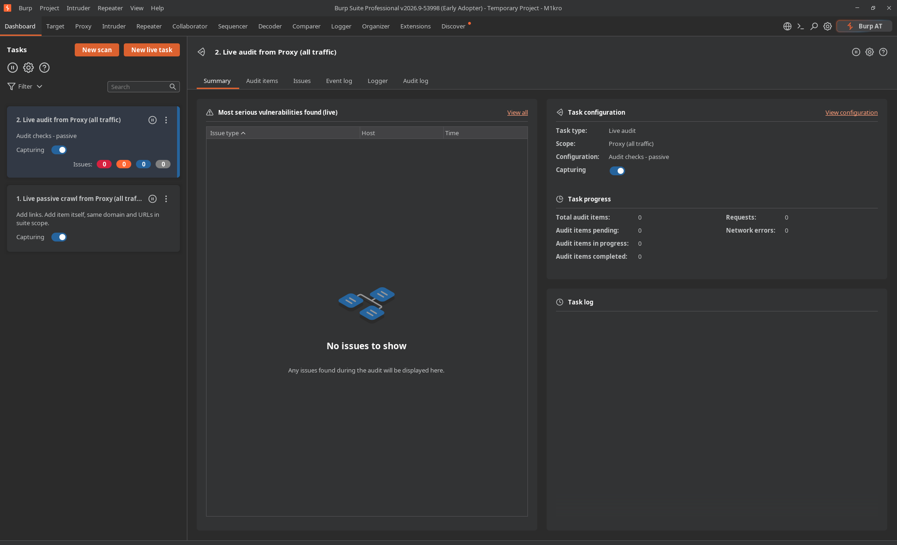

<div align="center">
  
</div>

<div align="center">

# $${\color{blue}M1kro-Loader-Burpsuite-Professional}$$
</div>

<p align="center">Burp Suite Professional is the web security tester's toolkit of choice. Use it to automate repetitive testing tasks — then dig deeper with its expert-designed manual and semi-automated security testing tools. This loader activates Burp Suite Professional fully offline: a keygen generates the license and activation response, and a Java agent patches the license check in memory at runtime. The original Burp JAR is never modified, nothing is written to disk, and it never touches the network.</p>

<h3 align="center">

[Overview](https://portswigger.net/burp/pro)
</h3>

<br>

> For educational and research use. Buy a genuine license from PortSwigger for commercial use.

<br>

#  $${\color{green}Requirements}$$

The agent relies on `jdk.internal.org.objectweb.asm`, which ships only with **JDK 21 or older** (removed in JDK 22+). Burp must run on JDK 21. The keygen itself works on any JDK.

```sh
# Arch / CachyOS
sudo pacman -S jdk21-openjdk

# Debian / Ubuntu
sudo apt install openjdk-21-jdk
```

<br>

#  $${\color{magenta}Linux-Installation}$$

```sh
git clone https://github.com/MuxammadiyevG/m1kro-loader.git
cd m1kro-loader
# put your burpsuite_pro_vXXXX.jar into this folder
```

## Run
```sh
./run-burp.sh ./burpsuite_pro_v2026.9.jar
```
Always launch Burp through `run-burp.sh` — it picks JDK 21 and attaches the agent automatically. If you open Burp with a plain `java -jar` (no agent), you get `INVALID_LICENSE`, because the check is patched at runtime.

<br>

## Terminal command

Install a global `burpsuitepro` command so you can launch Burp from any terminal:

```sh
./install.sh
burpsuitepro
```

`install.sh` writes a small launcher to `/usr/local/bin/burpsuitepro` that calls `run-burp.sh` (JDK 21 + agent, and it auto-detects the Burp jar sitting next to it). Prefer another location? `BIN_DIR=/usr/bin ./install.sh`.

<br>

## Setup License

Run the keygen in a separate terminal:
```sh
java -jar loader.jar --name "M1kro"
```

Note: Copy the license from the loader to Burp Suite > paste it > Next > manual activation > copy Burp's request key into the loader > copy the response key back into Burp Suite.

Press `Ctrl+D` to quit the keygen. Once activated, Burp remembers the license and won't ask again — but you still open it with `run-burp.sh` every time.

<details><summary></summary>

## License only (no activation)
```sh
java -jar loader.jar --license-only --name "M1kro"
```

## One-liner activation
```sh
echo "ACTIVATION_REQUEST_HERE" | java -jar loader.jar
```

## Flags
```
-n, --name NAME     Name embedded in the generated license (default: M1kro)
    --license-only  Print only the license text, then exit
-h, --help          Show help
```
</details>

<br>

## Shortcut Launcher - (KDE)

Create an application launcher whose command is the full path to `run-burp.sh` (with the Burp JAR as its argument), and pick any Burp icon. Opening it from the menu launches Burp with JDK 21 + the agent, so the license works there too. Pin it to the taskbar to keep it handy.

```sh
# refresh the menu cache after adding the .desktop entry
update-desktop-database ~/.local/share/applications
kbuildsycoca6 --noincremental
```

<br>

#  $${\color{green}macOS-Installation}$$

Install JDK 21 with Homebrew, then use the same scripts:

```sh
brew install openjdk@21
git clone https://github.com/MuxammadiyevG/m1kro-loader.git
cd m1kro-loader
# put your burpsuite_pro_vXXXX.jar here
./install.sh        # adds the global `burpsuitepro` command
burpsuitepro
```

`run-burp.sh` auto-detects the Homebrew JDK 21, or run it explicitly with `JDK=$(/usr/libexec/java_home -v 21) ./run-burp.sh`. The keygen is identical: `java -jar loader.jar --name "M1kro"`.

<br>

#  $${\color{green}Windows-Installation}$$

The agent and keygen work the same, but the bash scripts don't run natively — use the PowerShell launcher and make sure **JDK 21** is on your `PATH`.

```powershell
# in the m1kro-loader folder, in PowerShell
.\run-burp.ps1 .\burpsuite_pro_v2026.9.jar
```

Keygen:

```powershell
java -jar loader.jar --name "M1kro"
```

> Simplest alternative: run the Linux steps inside **WSL**. The PowerShell launcher assumes `java` is JDK 21; otherwise set `$env:JDK` to a JDK 21 home.

<br>

#  $${\color{green}How-it-works}$$

When Burp verifies the RSA license signature it calls `BigInteger.oddModPow`. The agent patches that method in memory to swap PortSwigger's public modulus for the keygen's own modulus, so a license signed by the keygen looks genuine. Extra patches bypass the license-validation routine inside the `burp/` classes and fake the LicenseSpring response used by Burp Bounty Pro. All of this lives only in RAM while the agent runs — the Burp JAR on disk stays original and license-free.

<br>

#  $${\color{green}Troubleshooting}$$

| Problem | Cause | Fix |
|--------|-------|-----|
| `burpsuitepro: command not found` | Command not installed / not on PATH | Run `./install.sh`, then open a new terminal |
| `INVALID_LICENSE` | Agent not attached | Open via `run-burp.sh`, not plain `java -jar` |
| `package jdk.internal.org.objectweb.asm does not exist` | JDK 22+ in use | Use JDK 21 (`run-burp.sh` does this automatically) |
| Burp restarts itself on launch | Normal — the agent persists | Do nothing |
| Keygen prints no license | Wrong argument order | Put `--name` *after* `java -jar loader.jar` |

<br>

